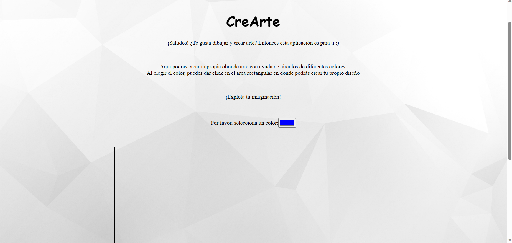
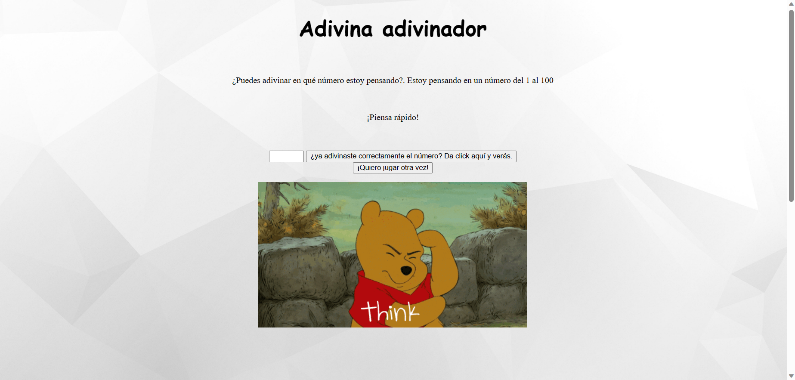
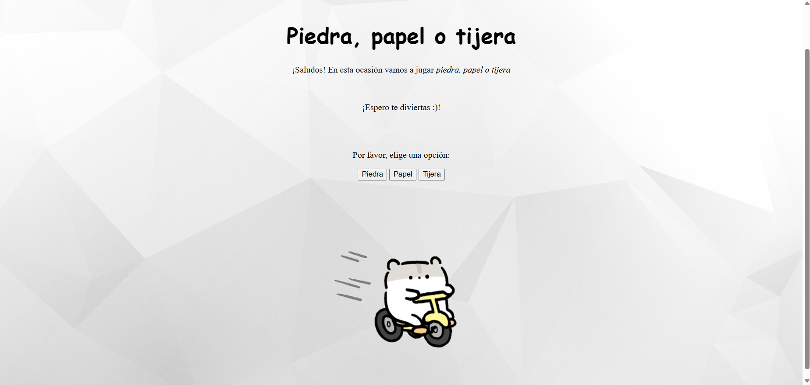

# Prueba de habilidades

### Actividad realizada
Desarrollar alguna aplicación con las tecnologías que me sienta más cómoda, considerando usar al menos un lenguaje de programación y algunas herramientas externas de apoyo que puedan robustecer mi aplicación.

Las tecnologías aplicadas fueron las siguientes:
-    Bootstrap 
-    HTML 
-    CSS 
-    JavaScript 
-    Git 
-    GitHub 

### ¿En qué consiste el proyecto?
Este proyecto consiste en una página web adaptable a dispositivos de distintos tamaños en donde se puede acceder a 3 distintas aplicaciones (juegos). Los tres juegos son los siguientes:

- Creación de tu propia obra de arte con círculos:

- Adivina el número del 1 al 100:

- Piedra, papel o tijeras:

### Página web 

Puedes encontrar el proyecto en el siguiente link: https://hannycarballo.github.io/pruebaHabilidades/

¡Gracias por su atención!
